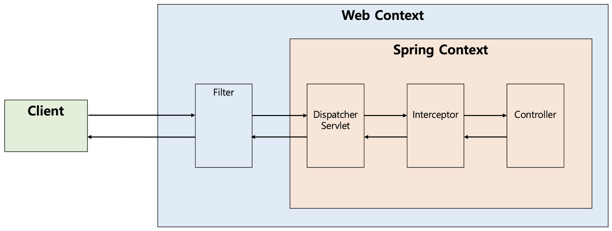
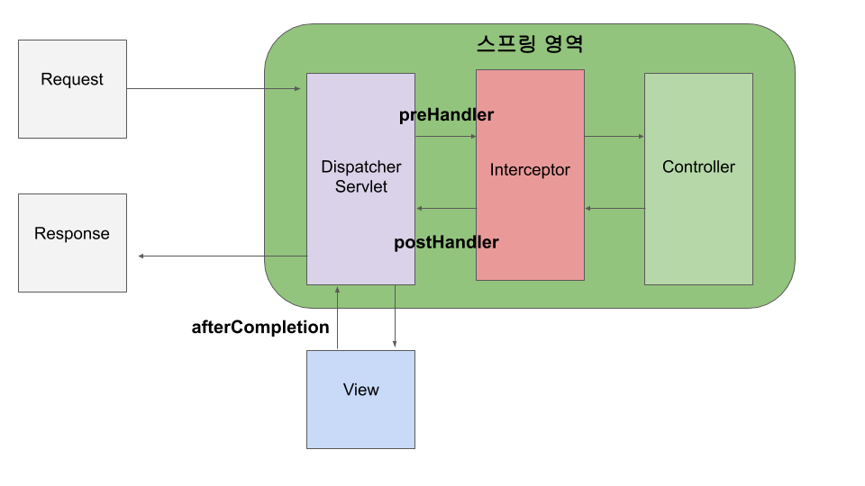
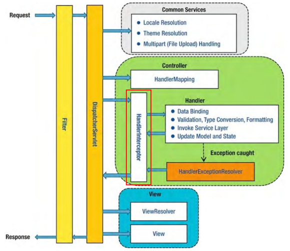

# 13. 세션, 인터셉터, 쿠키

# 세션
### 컨트롤러에서 HttpSession 사용하기

**첫 번째 방법**

- 요청 매핑 어노테이션 적용 메서드에 `HttpSession` 파라미터를 추가한다.
- 스프링 MVC 는 컨트롤러의 메서드를 호출할 때 `HttpSession` 객체를 파라미터로 전달한다.
- `HttpSession` 을 생성하기 전이며 새로운 `HttpSession` 을 생성하고 그렇지 않으면 기존에 존재하는 `HttpSession` 를 전달한다.
- `HttpSession` 을 항상 생성한다

```java
@PostMapping
public String from(LoginComand loginComand, Errors errors, HttpSession httpSession) {
    // .. sessionn을 사용하는 코드
}
```

**두 번째 방법**

- 요청 매핑 어노테이션 적용 메서드에 `HttpServletRequest` 파라미터를 추가하고 `HttpServletRequest` 를 이용해서 `HttpSession` 을 구한다.
- `HttpSession` 를 필요한 시점에만 생성할 수 있다.

```java
@PostMapping
public String from(LoginComand loginComand, Errors errors, HttpServletRequest request) {
    HttpSession session = request.getSession();
    // .. sessionn을 사용하는 코드
}
```

# 인터셉터



## 인터셉터란?

DispatcherServlet 이 받아온 클라이언트 요청을 Controller 로 넘기기 전에 (Controller 의 Handler 를 호출하기 전에) 혹은 Handler 가 실행된 후 가로채서 개발자가 원하는 추가적인 작업을 수행하도록 하는 모듈이다.

정리하자면 2가지 역할을 해준다.

1. Handler에 요청을 전달하기 전/후로 **추가적인 작업**이 가능하다.
2. View 렌더링이 된 후 클라이언트에게 Reponse를 전달하기 전에 **추가적인 작업**이 가능하다.


## Filter 와의 차이



**`Filter` -> `DispactcherServlet` -> `Interceptor`** 순서로 요청이 전달된다.

즉 Filter가 Interceptor보다 클라이언트의 요청을 먼저 받아들인다.

- 정답은 아니지만 DispactcherServlet를 기준으로 Spring과 관련된 작업이 아니라면(= Web에 대한 전반적인 작업) Filter에서 구현하는게 적합하다고 생각한다.


## 왜 사용하는가?

특정 Controller 의 Handler 가 실행되기 전이나 후에 추가적인 작업을 수행하기 위해 사용된다.

**어떤 이점이 있는가?**

사용자가 권한이 있는 경우에만 수행되는 Controller 가 있을 경우 Handler 가 실행되기 전에 권한을 확인하고 수행하도록 할 수 있다.

만약 해당 작업을 먼저 수행해야하는 Handler 가 수천 개일 경우 어떻게 될까?

1. 수천 개의 중복 코드가 발생하여 메모리 낭비나 서버 부하 문제가 발생할 수 있다.
2. 개발자가 해당 작업을 빠트릴 가능성이 있다. → 권한 문제의 경우 큰 보안 이슈가 발생할 수 있음

이렇게 Interceptor 를 통해 한 번에 수행하게 되면, 한 기능에 대한 코드 중복을 줄이고 한 곳에서 공통된 수행하기 때문에 책임과 관심사의 분리가 이루어질 수 있을 것 같다.

## 어떤 용도로 사용되는가?

주로 서비스 로직을 활용하여 요청 정보 정합성 처리를 담당한다.

- 인증/인가 등과 같은 공통 작업
    - 대표적인으로 인증이나 인가와 같이 클라이언트 요청과 관련된 작업들을 컨트롤러로 넘어가기 전에 검사할 수 있다.
- API 호출에 대한 로깅
    - 전달 받는 HttpServletRequest, HttpServletResponse 객체를 통해 클라이언트의 정보를 기록할 수 있다.
- Controller로 넘겨 주는 데이터 가공
    - 전달 받는 HttpServletRequest, HttpServletResponse 객체를 가공하여 컨트롤러에 넘겨줄 수 있다.
- AOP 흉내
    - `preHandle()` 메소드의 3번째 파라미터인 HandlerMethod로 실행될 메소드의 시그니처 등 추가적인 정보를 파악해서 로직 실행 여부를 판단할 수 있다.

### 공식문서

## HandlerInterceptor

> Workflow interface that allows for customized handler execution chains. Applications can register any number of existing or custom interceptors for certain groups of handlers, to add common preprocessing behavior without needing to modify each handler implementation.
A HandlerInterceptor gets called before the appropriate HandlerAdapter triggers the execution of the handler itself. This mechanism can be used for a large field of preprocessing aspects, e.g. for authorization checks, or common handler behavior like locale or theme changes. Its main purpose is to allow for factoring out repetitive handler code.
>


→ 적절한 HandlerAdapter가 핸들러 자체의 실행을 트리거하기 전에 HandlerInterceptor 를 실행한다.

관훤 확인이나 지역/테마 변경가은 공통적인 핸들러 동작같이 넓은 범위에서 사용될 수 있다. 주요 목적은 반복되는 핸들러 코드를 분리하는 것이다.

## 구현 수단

1. 스프링에서 제공하는 **org.springframework.web.servlet.HandlerInterceptor** 인터페이스 구현
2. **org.springframework.web.servlet.handler.HandlerInterceptorAdapter** 추상클래스 오버라이딩

HandlerInterceptorAdapter 추상 클래스 경우 HandlerInterceptor 인터페이스를 상속받아서 구현되어 있다.

**[HandlerInterceptor API(Spring 5.3.2버전)](https://docs.spring.io/spring-framework/docs/current/javadoc-api/org/springframework/web/servlet/HandlerInterceptor.html)**

**[HandlerIntreceptorAdapter API(Spring 5.3.2버전)](https://docs.spring.io/spring-framework/docs/current/javadoc-api/org/springframework/web/servlet/handler/HandlerInterceptorAdapter.html)**

## Interceptor Process

1. `preHandler`
    - 요청을 처리할 Handler 로 보내기 전에 실행
    - true 를 리턴해줘야 다음 요청을 실행
2. **요청 처리**
3. `postHandler`
    - Handler 가 요청을 처리하면 postHandler 호출
    - `postHandle`(**HttpServletRequest** request, **HttpServletResponse** response, **Object** handler, **ModelAndView** modelAndView)
        - View를 렌더링하기 전에 postHandle 메소드가 호출된다. 그렇기 때문에 modelAndView 정보를 알 수 있다. 특정 View에 modelAndView 값을 수정해야할 필요가 있다면 postHandle 메소드에서 작업이 이뤄지면 된다.
4. **View 렌더링**
    - postHandler 에 정의된 작업이 끝나면 View 렌더링
5. `afterCompletion`
    - View 렌더링이 끝나면 afterCompletion 호출
    - afterCompletion 에 정의된 작업이 끝나면 클라이언트에게 최종적인 Response 전달
    - `afterCompletion`(**HttpServletRequest** request, **HttpServletResponse** response, **Object** handler, **Exception** ex)
        - 클라이언트에게 최종적으로 Response를 전달하기 전에 호출되는 afterCompletion 메소드에는 Exception 정보가 담겨온다. 그렇기 때문에 afterCompletion 메소드에서는 response의 값을 Control 하거나 Exception 값에 따른 핸들링을 하면 된다.

## **Multi Interceptor**

**2개 이상의 Interceptor 가 등록될 경우**

```
1-1. preHandler 1
1-2. preHandler 2
2.   요청 처리
3-1. postHandler 2
3-2. postHandler 1
4.   View 렌더링
5-1. afterCompletion 2
5-2. afterCompletion 1
```

전체적인 Process는 preHandler > postHandelr > afterCompletion 로 Interceptor가 1개일 경우와 동일하다.

하지만 Interceptor 별 preHandler / postHandelr / afterCompletion 메소드의 호출이 뒤섞이게 된다.

### order() 로 우선순위 정하기

`order()` 로 Interceptor 호출의 우선순위를 정할 수 있다.

- 숫자가 낮을 수록 우선순위가 높다.

```java
registry.addInterceptor(new GreetingInterceptor()).order(0);
registry.addInterceptor(new GoodByeInterceptor()).order(-1);
```

## 예시 코드

**LoginInterceptor 구현 class**

```java
public class LoginInterceptor implements HandlerInterceptor {
    @Override
    public boolean preHandle(HttpServletRequest request, HttpServletResponse response, Object handler) throws Exception {
        String accessToken = request.getHeader("Authorization");
        if (accessToken == null) {
            throw new AuthorizationException();
        }
        return true;
    }
}
```

**Interceptor 등록하는 설정 클래스**

- `addPathPatterns` 로 url 특정 패턴 등록
- `excludePathPatterns` 로 url 특정 패턴 제외

# 쿠키

쿠키를 사용해서 이메일 기억하기

### 컨트롤러에서 @CookieValue를 이용해서 쿠키를 전달받기


```java
@PostMapping
public String from(LoginCommand loginCommand, @CookieValue(value = "REMEMBER", required = false) Cookie cookie) {
    if (cookie != null) {
        loginCommmand.setEmail(cookie.getValue());
    }
}
```

### 쿠키를 생성해서 응답 보내기

```java
@PostMapping
public String submit(LoginCommand loginCommand, HttpSession session, HttpServletResponse response) {
    Cookie rememberCookie = new Cookie("REMEMBER", loginCommand.getEmail());
    rememberCookie.setPath("/");
    rememberCookie.setMaxAge(60 * 60 * 24 * 30); // 30일 유효기간
    response.addCookie(rememberCookie);
}
```