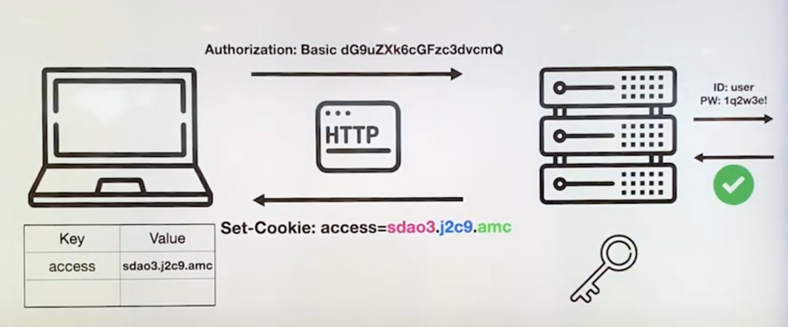
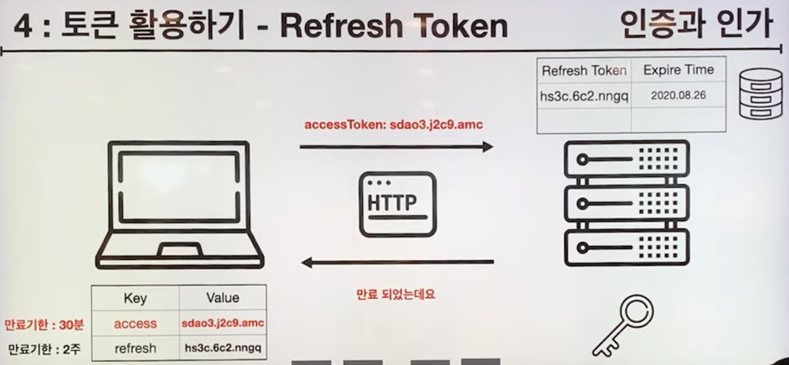
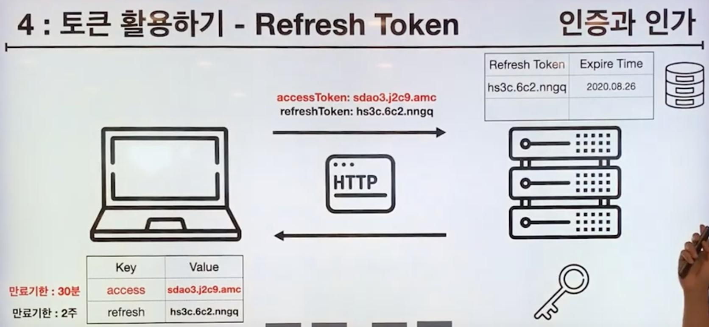
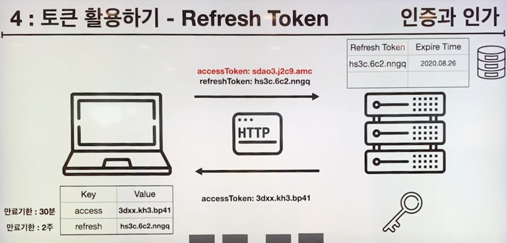

# 인증과 인가

## 인증이란?

- 식별 가능한 정보로 서비스에 등록된 유저의 **신원**을 입증하는 과정

## 인가란?

- 인증된 사용자에 대한 자원 접근 **권한** 확인

## 웹에서의 인증과 인가

**인증**

- 로그인하는 과정

**인가**

- 글을 쓰는 권한
- 다른사람의 글을 읽는 권한
- 다른사람의 글은 수정할 수 없음

즉, 자원을 적절한/유효한 사용자에게 전달/공개 하기 위한 방법

### 사전 지식

- HTTP 는 Stateless(무상태성) 하다.
- 서버와 클라이언트에 대한 상태와 정보를 가지고 있지 않다.
- 다음 요청에 대한 연관관계를 가지고 있지 않다.

## 1. Request Header 활용하기

- 브라우저가 인증과 인가를  해준다.
- 아이디와 비밀번호를 url 로 요청하면 브라우저에서 인코딩을 해줘서 요청 헤더에 담아서 보내준다.

**어떤 문제점이 있을까?**
- 인증 요청을 다시 하게 될 경우 **매번 인증(로그인)해야 한다.**

## 2. Browser 활용하기

- 브라우저의 스토리지(로컬 스코리지, 세션 스토리지, 쿠키가 있지만 쿠키)를 활용한다.
- 쿠키에 저장된 인코딩된 정보를 매번 요청마다 보내주어 사용자 인증 절차를 줄일 수 있다.

**어떤 문제점이 있을까?**
- 스토리지에 사용자의 정보가 유출되어 있어 누구나 접근할 수 있어 보안에 문제가 생길 수 있다.
- 클라이언트는 서버에 비해 보안에 취약하다.

## 3. Session 활용하기

- 인증된 사용자 식별자와 랜덤한 숫자로 SESSIONID 를 만들어서 사용자에게 넘겨준다.
- 클라이언트는 해당 SESSIONID로 서버에 요청한다.

**장점**

- 클라이언트 쪽에서 사용자의 raw 한 데이터를 가지고 있지 않기 때문에 해커가 가져가도 크게 문제가 되지 않는다.
- 세션에 만료 시간을 정할 수 있어서 만료된 SESSIONID 를 해커가 가져가도 문제되지 않는다.
- 세션관리를 서버에서 하기 때문에 탈취된 SESSIONID 는 서버에서 삭제하면 된다.

**어떤 문제점이 있을까?**

- 서버 다중화로 인한 문제가 발생한다.
- 서비스 규모가 커지면서 다중 서버를 사용할 경우 로드밸런싱을 통해 선택된 서버로 요청이 전달된다.
- SESSIONID 를 서버에서 가지고 있는데, SESSIONID 를 발급한 서버가 아닌 다른 서버에게 요청할 경우 인증되지 못하는 문제가 발생한다.
- 이를 해결하기 위해 SESSIONID 를 하나의 DB 에서 저장하고, 각 서버들이 해당 DB 를 통해 SESSIONID 를 확인하도록 했다.
- 하지만! 클라이언트가 많아질 경우 하나의 DB 에 요청이 몰리게 되어 서버가 터지게 되는 문제가 발생한다.

### Stateless

**클라이언트, 서버, 세션 저장소 모두 사용자의 정보(상태)를 가지고 있게 했지만 모두 문제점을 가지고 있다.**

“ 요청 / 응답에 상태를 실어보자! “

## 4. JWT (Json Web Token)

- 사용자 정보와 SecretKey 를 가지고 토큰을 발급한다. (비밀번호 같은 정보는 포함하지 않는다.)
- SecretKey 는 절대 노출되면 안된다 !! ! ! 서버 내부에 잘 관리해야 한다.

- 서버에서는 해당 토큰을 클라이언트에게 응답으로 보내준다.
- 이후 클라이언트는 해당 토큰을 헤더에 담아 요청을 보낸다.
- 서버는 해당 토큰을 SecretKey 를 가지고 유효성 검사를 진행한다.
- 디코딩해서 사용자 정보 (이름, 토큰 만료시기, 권한)을 확인한다. 비밀번호는 토큰에 포함시키지 않는다. (디코딩하기 쉽기 때문에 보안상)

**장점**
- 다중 서버에서 동일한 SecretKey 를 가지고 인증을 할 수 있다.
- **서버 확장성**에도 직결되는 장점이다. 서버가 3대에서 5대로 늘어나더라도 전혀 문제되지 않는다.

**문제점은 없나?**
- 당연히 토큰이 해커에 노출되면 인증을 뚫을 수 있기 때문에 문제가 된다.

### 토큰 활용하기 - Refresh Token

- refresh token 을 가지고 인증

- access Token 이 만료됐을 경우 서버는 클라이언트에게 토큰이 만료되었다고 응답한다.
- 클라이언트는 refreshToken 과 함께 재요청하게 되고, 서버는 돌아온 refreshToken 을 DB 와 비교하여 인증을 진행하고, 새로운 토큰을 발급하여 보내준다.
- 토큰으로 상태관리 하기 때문에 세션을 둘 필요가 없어 효율성이 좋아지고 DB 를 접근하지 않아도 되기 때문에 속도가 빨라진다.
- 하지만 토큰도 관리 대상이기 때문에 보안에 신경써야한다!

## 5. 다른 서비스를 통해 인증 받기
### OAuth

- 생활코딩 - 이고잉 영상
- 1기 루피

참고

- [[10분 테코톡] 🎡토니의 인증과 인가](https://www.youtube.com/watch?v=y0xMXlOAfss)