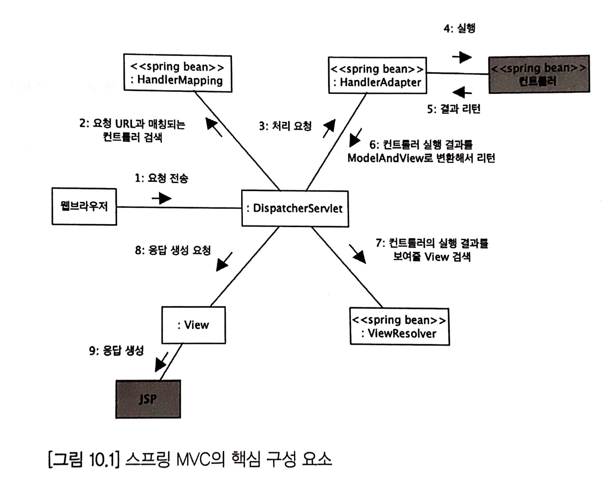
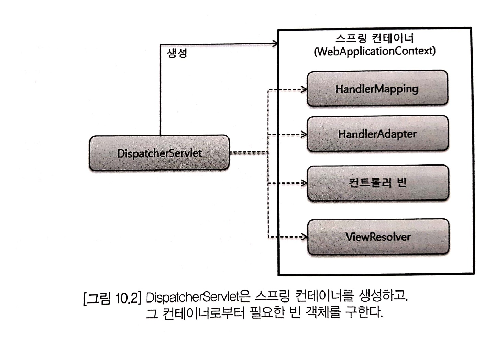

# 스프링 MVC 프레임워크 동작 방식

## 스프링 MVC 핵심 구성 요소



1. 웹 브라우저로부터 요청이 전송되면 `DispatcherServlet`이 요청을 받는다.
2. `DispatcherServlet`은 `HandlerMapping`에 컨트롤러 검색을 요청한다.
3. `HandlerMapping`이 컨트롤러를 찾으면 `DispatcherServlet`은 `HandlerAdapter` 빈에게 요청 처리를 위임한다.
4. `HandlerAdapter`는 요청에 대응하는 컨트롤러 빈을 찾아 실행하고 결과를 받는다.
5. `HandlerAdapter`는 처리 결과를 ModelAndView로 변환해서 `DispatcherServlet`에게 반환한다.
6. `DispatcherServlet`는 컨트롤러 실행 결과를 보여줄 View를 찾는 과정을 `ViewResolver`에게 위임한다.
7. `DispatcherServlet`은 `ViewResolver`가 찾은 View 객체에 응답 결과를 생성을 요청하고, View는 웹 브라우저에게 최종 결과를 전송한다.  


## DispatcherServlet

> Spring MVC, as many other web frameworks, is designed around the front controller pattern where a central Servlet, the DispatcherServlet, provides a shared algorithm for request processing, while actual work is performed by configurable delegate components. This model is flexible and supports diverse workflows.

스프링 MVC는, 많은 웹 프레임워크와 마찬가지로, `Front controller pattern`으로 설계되어 있다. `DispatcherServlet`이 중심에 있어 요청을 처리하고 실제 작업은 각각의 요소들에 위임한다.



`DispatcherServlet`은 스프링 컨테이너를 생성하고 그 컨테이너로부터 필요한 빈 객체를 구하게 된다.

> In turn, the DispatcherServlet uses Spring configuration to discover the delegate components it needs for request mapping, view resolution, exception handling, and more.

`DispatcherServlet`은 스프링 설정을 사용해 실제 작업들(Request Mapping, View Resolution, Exception Handling 등)을 위임할 요소들을 검색한다.

## @Controller를 이한 HandlerMapping과 HandlerAdapter

### HandlerMapping

@Controller를 적용한 객체는 하나의 핸들러이다. `DispatcherServlet`는 요청을 처리할 핸들러 객체를 찾기 위해 `HandlerMapping`을 사용한다.

> The two main HandlerMapping implementations are RequestMappingHandlerMapping (which supports @RequestMapping annotated methods) and SimpleUrlHandlerMapping (which maintains explicit registrations of URI path patterns to handlers).

`HandlerMapping`의 구현에는 2가지 방법이 있다.

1. RequestMappingHandlerMapping(@RequestMapping 주석이 달린 메서드를 지원하는 것)

2. SimpleUrlHandlerMapping(URI 경로 패턴을 핸들러에 명시적으로 등록하는 유지 관리하는 것)

`RequestMappingHandlerMapping`은 @GetMapping, @PostMapping 등 @RequestMapping을 이용해 요청을 처리할 컨트롤러를 찾는다.

`SimpleUrlHandlerMapping`은 url패턴에 매핑되는 컨트롤러를 사용하는 방법이다.

```java
<bean class="org.springframework.web.servlet.handler.SimpleUrlHandlerMapping">
	<property name="mappings">
			<props>                                
					<prop key="/**/login.do">staticPageController</prop>
					<prop key="/static/*.html">staticPageController</prop>
			</props>
	</property>
</bean>
```

### HandlerAdapter

`DispatcherServlet`은 요청에 맞는 핸들러를 실행하기 위해 `HandlerAdapter`를 사용한다.

`RequestMappingHandlerAdapter`는 컨트롤러의 메서드를 실행한 뒤 그 결과를 ModelAndView 객체로 변환해 `DispatcherServlet`에 반환한다.

## ViewResolver

> ViewResolver provides a mapping between view names and actual views. 

`ViewResolver`는 view이름과 실제 view를 매핑하는 역할을 한다.

별도의 `ViewResolver`를 등록하지 않을 경우 기본적으로 `DispatcherServlet`에 내장되어 있는 `InternalResourceViewResolver`를 사용한다.

컨트롤러에서 문자열을 반환할 때 이에 맞는 view를 보여줄 수 있는 것도 `ViewResolver` 덕분이다.

```java
@GetMapping("/")
public String welcome() {
    return "index";
}
```

렌더링할 view의 경로를 설정하기 위해서 `ViewResolver`에 prefix or suffix 설정을 별도로 해줘야 한다. 아래와 같이 설정했을 경우 뷰 이름은 "/index"라면 "/WEB-INF/view/index.jsp" 경로를 view 코드로 사용하는 `InternalResourceView` 객체를 리턴한다. `InternalResourceView` 객체는 경로에 지정한 코드를 실행해 응답 결과를 생성한다.
```java
@Bean
public ViewResolver internalResourceViewResolver() {
    InternalResourceViewResolver bean = new InternalResourceViewResolver();
    bean.setViewClass(JstlView.class);
    bean.setPrefix("/WEB-INF/view/");
    bean.setSuffix(".jsp");
    return bean;
}
```