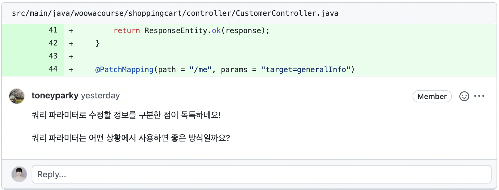

# MVC4 : 날짜 값 변환, @PathVariable, 익셉션 처리

# @PathVariavle을 이용한 경로 변수 처리

다음은 ID가 10인 회원의 정보르르 조회하기 위한 URL이다.

> http://localhost:8080/users/10

이렇게 경로의 일부가 고정되어 있지 않고 달라질 때 사용할 수 있는 것이 `@PathVariable` 애노테이션이다.

```java
// MemberDetailController.java
@Controller
public class MemberDetailController {
    ...
        // {}중괄호에 둘러쌓인 부분이 경로 변수
    @GetMapping("/members/{id}")
    public String detail(@PathVariable("id") Long memId, Model model) {
        Member member = memberDao.selectById(memId);
        if (member == null) {
            throw new MemberNotFoundException();
        }
        model.addAttribute("member", member);
        return "member/memberDetail";
    }
    ...
}
```

> 궁금한점 :  
Type 1 => http://localhost:8080/users?id=1  
Type 2 => http://localhost:8080/users/1
  


# 컨트롤러 익셉션 처리

컨트롤러에서 발생한 익셉션을 직접 처리하기 위해 @ExceptionHandler 어노테이션을 사용한다.  

@ControllerAdvice 어노테이션을 이용해 공통 익셉션을 처리

## @Exception 어노테이션을 이용한 컨트롤러 익셉션 직접 처리

컨트롤러 내에 @ExceptionHandler 어노테이션을 적용한 매서드가 존재하면 그 메서드가 익셉션을 처리한다.

```java
// MemberDetailController.java
@Controller
public class MemberDetailController {
    ...
    @GetMapping("/members/{id}")
    public String detail(@PathVariable("id") Long memId, Model model) {
        Member member = memberDao.selectById(memId);
        if (member == null) {
            throw new MemberNotFoundException();
        }
        model.addAttribute("member", member);
        return "member/memberDetail";
    }

        // 아래의 두 매서드는 각각 해당하는 타입의 익셉션을 처리하며 뷰 이름을 리턴
    @ExceptionHandler(TypeMismatchException.class)
    public String handleTypeMismatchException() {
        return "member/invalidId";
    }

    @ExceptionHandler(MemberNotFoundException.class)
    public String handleNotFoundException() {
        return "member/noMember";
    }
}
```

## @ControllerAdvice 어노테이션을 이용한 공통 익셉션 처리

다수의 컨트롤러에서 동일 타입의 익셉션이 발생하는 경우 공통으로 처리할 수 있다.  

@ControllerAdvice 어노테이션이 적용된 클래스는 지정한 범위의 컨트롤러에 공통으로 사용될 설정을 정할 수 있다. 

@ControllerAdvice 어노테이션 적용 클래스가 동작하기 위해 해당 클래스를 스프링의 Bean으로 등록해야 한다.

```java
// CommonExceptionHandler.java
// spring 패키지와 그 하위 패키지에 속한 컨트롤러 클래스를 위한 공통 기능을 정의  
@ControllerAdvice("spring")
public class CommonExceptionHandler {
        // 처리하는 익셉션의 종류는 RuntimeException
    @ExceptionHandler(RuntimeException.class)
    public String handleRuntimeException() {
        return "error/commonException";
    }
}
```

## @ExceptionHandler 적용 매서드의 우선 순위

@ControllerAdvice 클래스에 있는 @ExceptionHandler 매서드와 컨트롤러 클래스에 있는 @ExceptionHandler 매서드 중,
컨트롤러 클래스 내부의 @ExceptionHandler 매서드가 우선한다.  

컨트롤러 매서드를 실행하는 도중 익셉션이 발생하면 다음의 순서로 처리한다.  

1. 같은 컨트롤러에 위치한 @ExceptionHandler 매서드 중 해당 익셉션을 처리할 수 있는 매서드를 검색
2. @ControllerAdvice 클래스에 위치한 @ExceptionHandler 매서드를 검색

# 커맨드 객체 Date 타입 프로퍼티 변환 처리 : @DateTimeFormat

`<input>`에 입력한 문자열을 LocalDateTime 타입으로 변환이 필요한 경우 `@DateTimeFormat` 어노테이션을 사용할 수 있다.

```java
// ListCommand.java
public class ListCommand {
        // 어노테이션을 적용하여 지정된 형식으로 변환
    @DateTimeFormat(pattern = "yyyyMMddHH")
    private LocalDateTime from;
    @DateTimeFormat(pattern = "yyyyMMddHH")
    private LocalDateTime to;
    ...
}
```

```java
// MemberListController.java
@Controller
public class MemberListController {
    @RequestMapping("/members")
    public String list(
            @ModelAttribute("cmd") ListCommand listCommand,
            Model model) {
                // from과 to를 이용하여 member 목록을 구한 뒤, 뷰에 "members" 속성으로 전달
        if (listCommand.getFrom() != null && listCommand.getTo() != null) {
            List<Member> members = memberDao.selectByRegdate(
                    listCommand.getFrom(), listCommand.getTo());
            model.addAttribute("members", members);
        }
        return "member/memberList";
    }
}
```

## 변환 에러 처리

입력을 받을 때 입력형식인 “yyyyMMddHH”와 달리 “yyyyMMdd”가 입력되면 에러 발생한다.  

다음과 같이 Errors 타입 파라미터를 요청 어노테이션 적용 매서드에 추가하면, 에러 메시지를 보여줄 수 있다.

```java
// MemberListController.java
@Controller
public class MemberListController {
    ...
    @RequestMapping("/members")
    public String list(
            @ModelAttribute("cmd") ListCommand listCommand,
            Errors errors, Model model) {
        if (errors.hasErrors()) {
            return "member/memberList";
        }
        if (listCommand.getFrom() != null && listCommand.getTo() != null) {
            List<Member> members = memberDao.selectByRegdate(
                    listCommand.getFrom(), listCommand.getTo());
            model.addAttribute("members", members);
        }
        return "member/memberList";
    }

}
```

Errors 타입 파라미터를 가질 경우 @DataTime의 형식에 맞지 않으면 Errors 객체에 "typeMismatch" 에러 코드를 추가한다.  

메세지 프로퍼티 파일을 통해 "typeMismatch"의 에러 메세지를 변경할 수 있다.

> typeMismatch.java.time.LocalDateTime = 잘못된 형식
