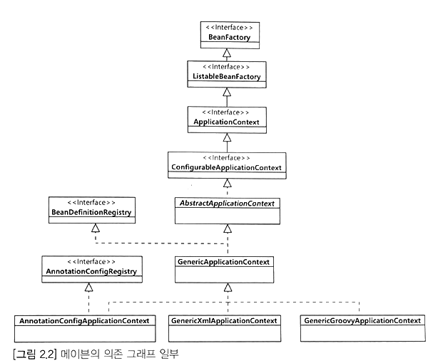

# Chapter 2 - 스프링 시작하기

### 빌드와 의존 전이

빌드 도구에는 크게 `Ant`, `Maven`, `Gradle`이 있다.  
요즘에는 `Maven`과 `Gradle`을 많이 사용하는 편이다.

#### Maven

- 설정 정보 관리 파일: pom.xml
- 코드 컴파일/실행 시 `<dependency>`로 설정한 아티팩트 파일 사용
- 로컬 레포지토리에 .jar 파일이 존재하면 해당 파일 사용
- 로컬 레포지토리에 존재하지 않으면 메이븐 원격 중앙 레포지토리에서 다운받음

> 의존 전이; Transitive Dependencies  
> `<dependency>`를 통해 아티팩트 파일을 다운 받을 때, 해당 아티팩트가 의존하는 아티팩트까지 다운로드 한다.  
> 의존하는 대상 뿐만 아니라 의존 대상이 의존하는 대상까지 함께 다운로드되므로 의존 전이라고 표현한다.

#### Gradle

- 설정 정보 관리 파일: build.gradle
- 명령어 실행에 성공하면 프로젝트 루트 폴더에 gradlew.bat, gradlew 래퍼 파일 생성

> 더 자세한 설명은 [블로그 글](https://yeonyeon.tistory.com/89) 로 대체한다.

### Spring bean 등록하기

- 스프링이 생성하는 객체
- `@Configuration`와 `@Bean`을 이용해 등록할 수 있음
- `@Component`를 이용해 등록할 수 있음

> `@Configuration`: 스프링 설정 클래스로 지정하는 어노테이션  
> `@Bean`: 메서드에 붙여 스프링이 해당 메서드로 객체를 생성해 빈으로 등록  
> `@Component`: 클래스에 붙이면 스프링이 객체를 생성해 빈으로 등록

#### example1

```java

@Configuration
public class AppContext {
    @Bean
    public CustomClass customClass() {
        return new CustomClass();
    }
}
```

#### example2

```java

@Component
public class CustomClass {
    // ...
}
```

### Spring은 객체 컨테이너



#### BeanFactory

- 객체 생성과 검색에 대한 기능 제공  
  ex: 객체 검색에 필요한 `getBean()` 메서드
- 싱글톤 / 프로토타입 빈 확인 기능 제공

#### ApplicationContext

- 메시지, 프로필 / 환경 변수 등 처리할 수 있는 기능 추가 정의
- 빈 객체의 생성, 초기화, 보관, 제거 등을 관리해 `Container`라고도 불림
- 다양한 구현체 존재
- AnnotationConfigApplicationContext: 자바 어노테이션을 이용한 클래스로부터 객체 설정 정보 가져오기
- GenericXmlApplicationContext: xml로부터 객체 설정 정보 가져오기
- GenericGroovyApplicationContext: 그루비 코드를 이용해 객체 설정 정보 가져오기

> 컨테이너란?
> - 객체를 생성 및 관리하며 의존 관계를 연결해주는 것.
> - 이 책에서는 `BeanFactory`와 `ApplicationContext` 등을 스프링 컨테이너라고 표현한다.

### 싱글톤 객체

- 싱글톤: 단일 객체(single object)
- 스프링은 **Bean 객체 단 하나만 생성**하는 것이 디폴트 설정
- 이를 싱글톤 범위를 갖는다고 표현

> 이 외에 프로토타입 범위도 존재하는데 이는 6장에서 다룬다.

<br>

# Chapter 3 - 스프링 DI

### 의존 주입; DI; Dependency Injection

- 여기서 의미하는 의존은 **객체 간의 의존**을 의미
- `의존`: 변경에 의해 영향받는 관계
- 한 클래스가 다른 클래스의 메서드를 실행할 때 이를 **의존**한다고 표현

#### example1 - 의존 객체 직접 생성하기

- 의존 객체 직접 생성
- 의존 객체인 `UserDao`를 변경하고 싶은 경우 `UserService`에서 직접 수정

```java
public class UserService {
    private UserDao userDao = new UserDao();
}
```

#### example2 - 의존 객체 주입받기

- 의존 객체 변경을 유연하게 하기 위해서는 생성자를 이용하는 것이 좋음

```java
public class UserService {
    private UserDao userDao;

    public UserService(UserDao userDao) {
        this.userDao = userDao;
    }
}
```

### 객체 조립기

- 객체를 생성하고 의존 대상이 되는 객체를 주입하는 역할
- Service 또는 Service 를 호출하는 곳에서 객체를 주입시키지 않아도 됨

#### example - 객체 조립기를 이용한 의존 주입

```java
public class Assembler {

    private UserDao userDao;
    private UserService userService;

    public Assembler() {
        userDao = new UserDao(); // userService의 의존 객체를 수정하고 싶다면 요 부분만 수정하면 된다.
        userService = new UserService(userDao);
    }

    public UserDao getUserDao() {
        return userDao;
    }

    public UserService getUserService() {
        return userService;
    }
}
```

### Spring & DI

- 스프링은 위의 조립기와 유사한 기능을 이미 제공함
- 객체 생성 및 생성 객체에 의존 주입

#### example - @Configuration과 @Bean 활용

```java
// 설정 클래스
@Configuration
public class ApplicationContext {

    @Bean
    public UserDao userDao() {
        return new UserDao();
    }

    @Bean
    public UserService userService() {
        return new UserService(userDao());
    }
}
```

#### 컨테이너 생성

- `ApplicationContext context = new AnnotationConfigApplicaionContext(ApplicaionContext.class)`
- 설정 파일 여러개도 가능 (ex: `new AnnotationConfigApplicaionContext(ApplicaionContext1.class, ApplicationContext2.class)`)

> 컨테이너를 직접 선언하지 않아도 자동으로 컨테이너가 생성되었던 것은 SpringApplication.run()에서 생성했기 때문이다.  
> 참고 자료: [Spring 공식 문서](https://docs.spring.io/spring-framework/docs/5.3.x/reference/html/core.html#beans-basics)

#### getBean()

- 컨테이너를 생성하면 getBean()을 통해 빈 객체를 가져올 수 있음
- BeanFactory 인터페이스에서 정의
- AbstractApplicationContext 클래스에서 구현
- `context.getBean("bean 이름", bean타입.class)`
    - 이름 불일치하는 경우: NoSuchBeanDefinitionException
    - 타입 불일치하는 경우: BeanNotOfRequiredTypeException
- `context.getBean(bean타입.class)`
    - 존재하지 않는 빈인 경우: NoSuchBeanDefinitionException
    - 타입 같은 빈이 여러개인 경우: NoUniqueBeanDefinitionException

### @Import 어노테이션

- 함께 사용할 설정 클래스 지정

#### example

```java

@Configuration
@Import(ApplicationContext2.class)
// @Import({ApplicationContext2.class, ApplicationContext2.class})
public class ApplicationContext {

    @Bean
    public UserDao userDao() {
        return new UserDao();
    }

    @Bean
    public UserService userService() {
        return new UserService(userDao());
    }
}
```

# Chapter 4 - 의존 자동 주입

### @Autowired 어노테이션

- `@Autowired`를 이용한 다양한 주입 방식은 [블로그](https://yeonyeon.tistory.com/220) 에 기술
- @Autowired
    - 일치하는 빈이 없는 경우: UnsatisfiedDependencyException
    - 타입이 같은 빈이 여러개인 경우: UnsatisfiedDependencyException

### @Qualifier 어노테이션

- 자동 주입 가능한 빈이 여러개인 경우 자동 주입할 빈을 지정할 수 있음
- 어노테이션 생략 시 빈의 이름을 한정자로 지정

#### example

```java
public class UserService {

    private UserDao userDao;

    @Autowired
    @Qualifier("dao1")
    public void setUserDao(UserDao userDao) {
        this.userDao = userDao;
    }
}
```

```java

@Configuration
public class ApplicationContext {

    @Bean
    @Qualifier("dao1") // <- 해당 bean이 사용된다!
    public UserDao userDao1() {
        return new UserDaoImpl1();
    }

    @Bean
//    @Qualifier("dao2")
    public UserDao dao2() { // @Qualifier 어노테이션 생략 시 빈의 이름을 한정자로 지정
        return new UserDaoImpl2();
    }
}
```

### @Autowired 어노테이션 필수 여부 정하기

- 매칭되지 않는 bean 이 존재하면 Exception 발생
- 자동 주입할 대상이 필수가 아닌 경우는 어떻게 할까?

#### @Autowired(required = false)

- Spring 5 버전부터 지원
- 빈이 존재하지 않으면 자동 주입 대상에 할당 안함

```java
public class UserService {

    @Autowired(required = false)
    private UserDao userDao;
}
```

#### Optional

- Java 8부터 지원
- 빈이 존재하지 않으면 자동 주입 대상에 빈 Optional 할당

```java
public class UserService {

    @Autowired
    private Optional<UserDao> userDao;
}
```

#### @Nullable

- 빈이 존재하지 않으면 자동 주입 대상에 null 할당

```java
public class UserService {

    @Autowired
    @Nullable
    private UserDao userDao;
}
```

### 자동 주입 vs 수동 주입

 자동 주입과 수동 주입 코드가 섞이면 주입이 되지 않아 NullPointerException 발생하는 경우 원인 찾는게 오래 걸린다. 
일관되게 사용하는 것이 좋다. 
관리할 빈이 너무 많으면 설정 정보가 커지고 이를 관리하는 것이 매우 부담스러워진다. 
가능하면 스프링이 잘 지원해주는 자동 주입을 사용하자.
다만 수동 주입이 더 좋은 경우도 분명 존재한다. 
어플리케이션 기능은 크게 핵심 기능과 부가 기능으로 나뉜다.

- 핵심 기능: 해당 객체가 제공하는 고유한 기능 (ex: CustomerService - 구매 로직)
- 부가 기능: 핵심 기능을 보조하는 기능 (ex: 로그 추적, 트랜잭션 처리 등)

부가 기능은 핵심과 비교해 수가 적고 어플리케이션에 광범위하게 영향을 미친다. 
이런 부분에 대해서는 수동 주입을 통해 명확하게 들어내는 것이 좋을 때도 있다.