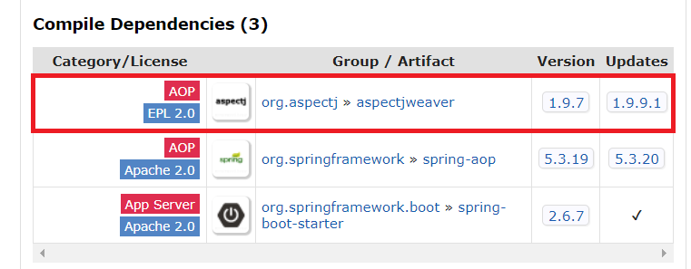

# AOP 프로그래밍

> = Aspect Oriented Programming  
> AOP가 뭔지 잘 모른다면 [블로그에 @Transactional](https://yeonyeon.tistory.com/223) 과 함께 설명해두었다.

- Spring의 AOP를 사용하기 위해서는 aspectjweaver 모듈 필요
- Spring Boot Starter AOP를 봐도 aspectjweaver가 있는걸 볼 수 있음



### 프록시; Proxy

- : 핵심 기능의 실행은 다른 객체에 위임하고 부가적인 기능을 제공하는 객체
- 핵심 기능을 구현하지 않음
- 여러 객체에 공통으로 적용할 수 있는 기능 구현

#### Spring의 Proxy
- `CGLIB`, `Dynamic Proxies`가 있음
- 실제 생성할 bean 객체가 인터페이스를 상속하면 인터페이스를 이용해 생성함  
  (`@EnableAspectJAutoProxy`의 `proxyTargetClass` 속성을 통해 변경 가능)

### AOP

- 관심 분리 프로그래밍
- 핵심 기능의 코드를 수정하지 않으며 공통 기능의 구현을 추가할 수 있게 됨

#### AOP의 방법

1. 컴파일 시점에 코드에 공통 기능 삽입
2. 클래스 로딩 시점에 바이트 코드에 공통 기능 삽입
3. 런타임에 프록시 객체를 생성해 공통 기능 삽입

> 1, 2는 Spring에서 제공하는 기능이 아니라 AspectJ를 이용해야 한다.

#### AOP 용어

- `Aspect`: 여러 객체에 공통으로 적용되는 기능
- `Advice`: 언제 Aspect 적용할지
- `Joinpoint`: 적용 가능한 지점
- `Pointcut`: Advice가 적용되는 Joinpoint
- `Weaving`: Advice를 코드에 적용하는 것

#### Advice 종류

- `@Before`: 메서드 호출 전
- `@AfterReturning`: 메서드가 Exception 없이 실행된 후
- `@AfterThrowing`: 메서드가 Exception 발생한 경우
- `@After`: 메서드 호출 후
- `@Around`: 메서드 실행 전/후 자유롭게

> Advice가 여러개 있는 경우 `@Order`를 이용해 순서를 정할 수 있다.

#### Spring AOP 예제

> 프록시는 스프링 프레임워크가 자동으로 생성해줌

```java
@Aspect // 1. Aspect로 사용할 클래스 지정
@Component
public class LoggerAop {

    private static final Logger logger = LoggerFactory.getLogger(LoggerAop.class);

    @Pointcut("execution(* wooteco.subway.ui.*Controller.*(..))")   // 2. 공통 기능을 적용할 PointCut (선택 사항)
    private void logTarget() {
    }

    @Before("logTarget()")  // 3. 공통 기능을 구현한 메서드에 Advice 지정
//    @Before("execution(* wooteco.subway.ui.*Controller.*(..))")
    public void printRequest(JoinPoint joinPoint) {
        logger.info("###### request ######");
        Object[] arguments = joinPoint.getArgs();

        if (arguments == null || arguments.length == 0) {
            logger.info("no request");
            return;
        }

        for (Object object : arguments) {
            logger.info(object.toString());
        }
    }

    @AfterReturning(pointcut = "logTarget()", returning = "object")
    public void printResponse(Object object) {
        logger.info("###### response ######");
        if (object == null) {
            logger.info("no response");
            return;
        }
        logger.info(object.toString());
    }
}
```

- ProceedingJoinPoint
  - 프록시 대상 객체의 메서드 호출 시 사용
  - `proceed()`를 통해 실제 대상 객체의 메서드 호출
- JoinPoint
  - `getSignature()`: 호출한 메서드의 시그니처
  - `getTarget()`: 대상 객체
  - `getArgs()`: 인자 목록

> 메서드 시그니처란?  
> : 메서드 이름과 파라미터를 합한 것

- Signature 인터페이스
  - `getName()`: 메서드 이름
  - `toLongString()`: 메서드 완전하게 표현한 문장 (메서드 리턴 타입, 파라미터 타입 모두 표시)
  - `toShortString()`: 메서드 축약해서 표현한 문장 (메서드 이름만 구현)

#### @EnableAspectJAutoProxy

- : `@Aspect` 애노테이션 붙인 클래스를 공통 기능으로 적용하기 위해 설정 클래스에 붙임
- `@Enable`로 시작하는 애노테이션은 관련 기능을 적용하는데 필요한 다양한 스프링 설정을 대신함

### 궁금한 점
- `@Aspect`는 왜 컴포넌트 스캔 대상이라고 할까?
- 왜 `@EnableAspectJAutoProxy`를 안붙여도 돌아갈까?