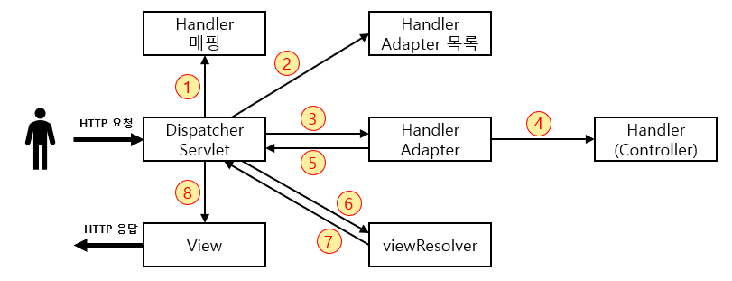

# Chapter 10 - 스프링 MVC 프레임워크 동작 방식

> 소신 발언...  
> 책의 내용은 이해하기 어려울 뿐더러 xml과 jsp 방식이 너무 레거시하다 느껴져 따라해보지 않았습니다.  
> 대신 영한님 강의를 통해 스프링 MVC의 동작 방식을 공부하고 그 내용을 정리했습니다.



1. 핸들러 조회: Handler 매핑을 통해 요청 url에 매핑된 핸들러(컨트롤러) 조회
2. 핸들러 어댑터 조회: 핸들러를 처리할 수 있는 핸들러 어댑터 조회
3. 핸들러 어댑터 실행
4. 핸들러 실행: 핸들러 어댑터가 실제 핸들러 실행. HTTP 메시지 컨버터를 이용해 read, write.
5. 결과 반환: 핸들러 어댑터가 핸들러의 반환 정보를 반환
6. viewResolver 호출: jsp의 경우 InternalResourceviewResolver가 자동 등록 및 사용됨
7. View 반환: viewResolver가 view의 논리 이름 -> 물리 이름으로 변환 후 렌더링 역할을 하는 View 객체 반환
8. View 렌더링: View를 이용해 렌더링

### DispatcherServlet

- 요청을 처리하고 적절한 응답을 렌더링하기 위한 특별한 bean
- DispatcherServlet -> FrameworkServlet -> HttpServletBean -> HttpServlet 상속

1. 서블릿 호출 시 HttpServlet의 service() 호출  
   (Spring MVC는 이를 FrameworkServlet에서 정의)

```
@Override
protected void doService(HttpServletRequest request,HttpServletResponse response)throws Exception{
    // ...
    doDispatch(request,response);
    // ...
}
```

2. 여러 메서드가 호출되며 DispatcherServlet.doDispatch() 호출

```
protected void doDispatch(HttpServletRequest request, HttpServletResponse  response) throws Exception {
   
   HttpServletRequest processedRequest = request;
   HandlerExecutionChain mappedHandler = null;
   ModelAndView mv = null;
   
   // 1. 핸들러 조회
   mappedHandler = getHandler(processedRequest);
   if (mappedHandler == null) {
      noHandlerFound(processedRequest, response);
      return;
   }
   
   // 2. 핸들러 어댑터 조회 - 핸들러를 처리할 수 있는 어댑터
   HandlerAdapter ha = getHandlerAdapter(mappedHandler.getHandler());
   
   // 3. 핸들러 어댑터 실행 -> 4. 핸들러 어댑터를 통해 핸들러 실행 -> 5. ModelAndView 반환
   mv = ha.handle(processedRequest, response, mappedHandler.getHandler());
   processDispatchResult(processedRequest, response, mappedHandler, mv, dispatchException);
}

private void processDispatchResult(HttpServletRequest request, HttpServletResponse response, HandlerExecutionChain mappedHandler, ModelAndView mv, Exception exception) throws Exception {
   // 뷰 렌더링 호출
   render(mv, request, response);
}

protected void render(ModelAndView mv, HttpServletRequest request, HttpServletResponse response) throws Exception {
   View view;
   String viewName = mv.getViewName();
   
   // 6. 뷰 리졸버를 통해서 뷰 찾기, 7. View 반환
   view = resolveViewName(viewName, mv.getModelInternal(), locale, request);
   
   // 8. 뷰 렌더링
   view.render(mv.getModelInternal(), request, response);
}
```

### Handler Mapping

- 특정 핸들러 찾기 (ex: Controller)

> 가장 우선순위 높은건 RequestMappingHandlerMapping과 RequestMappingHandlerAdapter이다.

### HandlerAdapter

- Handler Mapping이 찾은 Handler를 실행할 수 있는 Handler Adapter 필요

1. HandlerAdapter의 supports() 호출
2. 적합한 핸들러 어댑터가 선택
3. 핸들러 어댑터 실행