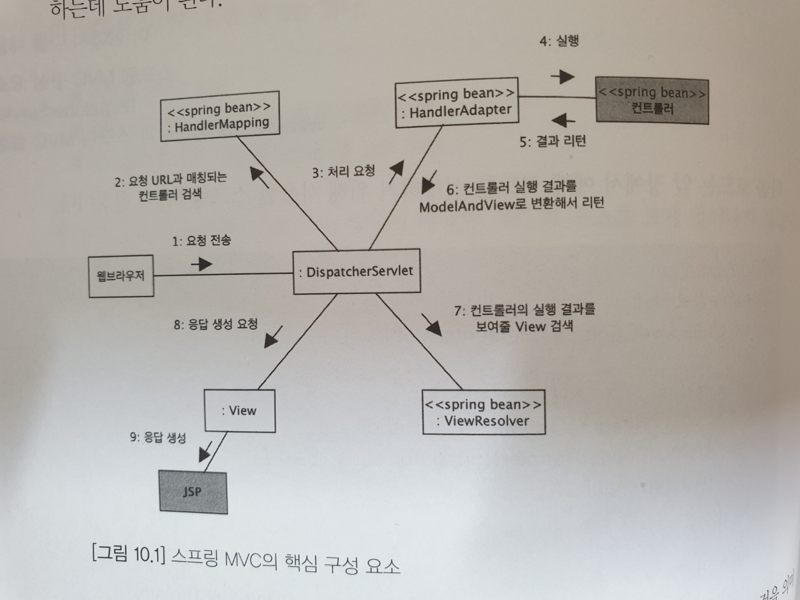

# 스프링 MVC 프레임워크 동작방식

### 10-1. 핵심구성

1. `DispatcherServlet` : 모든 연결 담당
- 요청 처리 방법
    1. `RequestMappingHandlerMapping` 을 통해 처리할 핸들러 검색
    2. 존재하지 않으면, `SimpleUrlHandlerMapping` 으로 검색
    - HandlerMapping `Bean` : 핸들러 객체를 찾기 위한 빈
    - HandlerAdapter `Bean` : 핸들러를 실행하기 위해 사용하는 빈
    - ViewResolver `Bean`
- 사용법
    - `EnableWebMvc` 적용
    - `HandlerMapping`, `HandlerAdapter`, `ViewResolver` 빈 등록


### 수행과정

1. 웹 브라우저의 요청 : `GET`, `POST`, `DELETE`, `PUT`, `PATCH`
2. `HandlerMapping` 는 요청경로(`/stations`)를 이용해 이를 처리할 컨트롤러 `Bean` 객체를 찾아 `DispatcherServlet` 에 반환
3. `DispatcherServlet` 은 `HandlerAdapter` 에 컨트롤러 처리를 위임한다.
4. 컨트롤러 실행
5. 컨트롤러 결과 반환
6. `HandlerAdapter` 은 `ModelAndView` 로 변환해 리턴한다.

    ```java
    @RequestMapping(value = "/", method = RequestMethod.GET)
    public String home(Model model) {
        String formattedDate = dateFormat.format(date);
        // Model 객체를 이용해서, view로 Data 전달
        model.addAttribute("serverTime", formattedDate );
    
        return "home"; // 뷰 파일 리턴
    }
    ```

7. `ViewResolver` 를 통해 View 검색
8. View 응답 생성 요청
9. 응답 생성