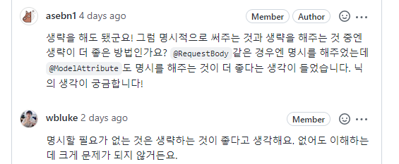

- 스프링 MVC를 사용해서 웹 어플리케이션을 개발한다!

  = `컨트롤러`, `뷰`를 구현한다. (모델은?)


### 11-1. 요청 매핑 애노테이션을 이용한 경로 매핑 `@Controller`

웹 어플리케이션을 개발하는 것?

- 특정 요청 URL을 처리할 코드
- 처리 결과를 HTML과 같은 형식으로 응답하는 코드
1. `RequestMapping`

    ```java
    @Controller
    @RequestMapping("/Common")                       // 공통 경로
    public class UserController {
        @RequestMapping("/step1")                    // 공통 경로를 재외한 나머지 경로
        public String step1() {
            // ...
        }
    
        @RequestMapping("/step2")
        public String step2() {
            // ...
        }
    }
    ```

2. `GetMapping`, `PostMapping`
- HTTP 요청에 따라
- 별도의 설정이 없으면 `GET` , `POST` 에 상관없이 `@RequestMapping`에 지정한 경로, 일치하는 요청 처리

    ```java
    @RequestMapping("/Common", method = RequestMethod.GET)
    @RequestMapping("/Common", method = RequestMethod.POST)
    ```


### 리다이렉트

- `redirect:경로`

```java
@GetMapping("/register/step1")
public void step1() {
	return "redirect:/register/step2";
}
```

### 요청 파라미터 접근

1. `HttpServletRequest` 사용

```java
@PostMapping("/register/step1")
public void step1(HttpServletRequest request) {
	String name = request.getParameter("username");  // get 메서드로 파라미터 구함
}
```

1. `@RequestParam`

```java
public void step1(@RequestParam(value="agree", defaultValue = "false) Boolean agree) {}
```

- value : 파라미터 이름
- default : 값이 없을 때, 값 지정
- required : 필수 여부 (true일때, 값이 없으면 Exception 발생)
1. `@ModelAttribute`
- 생략 가능 (리뷰어 `닉`은 생략을 추천했다)
- 파라미터를 한번에 받는 생성자가 있거나, setter가 있어야 한다.
- 속성이름 변경이 가능 :  `@ModelAttribut("formData") RequestClass request`
- 명시할 필요가 없다면, 명시하지 말자!


### 모델을 통해 컨트롤러에서 뷰에 데이터 전달

```java
@RequestMapping("/hello")
public String hello(Model model, String name) {
    model.addAttribute("greeting", "안녕하세요, " + name);
    return "hello";
}
```

- 요청 매핑 애노테이션이 적용된 메서드의 파라미터로 `Model` 을 추가
- `Model` 파라미터의 `addAttribute()` 메서드로 뷰에서 사용할 데이터 전달

### ModelAndView

- 두 가지를 한번에 처리할 수 있다.
    - `Model` 을 이용해서 `View`에 전달할 데이터 설정
    - 결과를 보여줄 뷰 이름 리턴

```java
@GetMapping
public ModelAndView form() {
    List<Question> questions = createQuestions();
    ModelAndView mav = new ModelAndView();
    mav.addObject("questions", questions);
    mav.setViewName("survey/surveyForm");
    return mav;
}
```