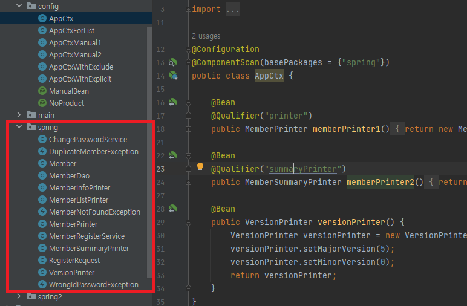
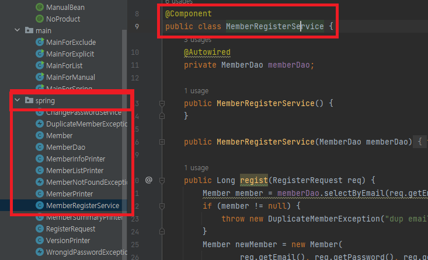
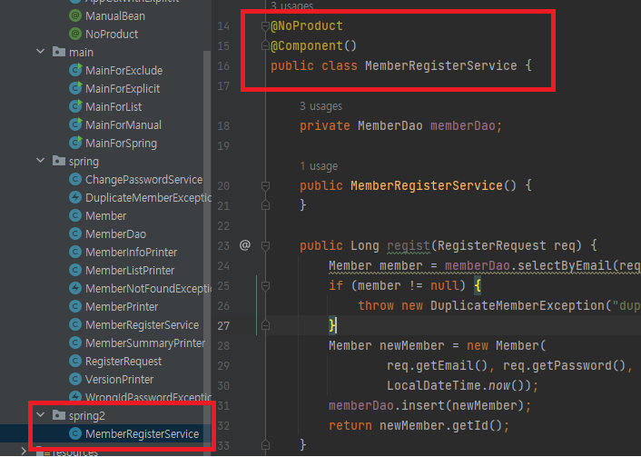
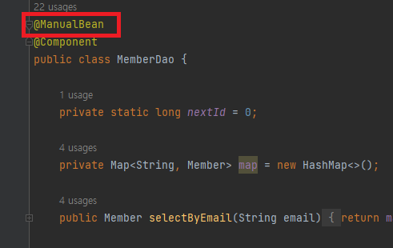
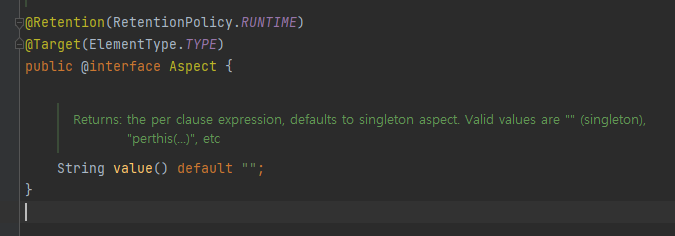

### 5-1. `@Component` : 스캔 대상 지정

- 클래스를 스캔 대상으로 **지정**

```java
@Component
public class MemberDao {

	...
}
```

- memberDao로 지정됨

```java
@Component("infoPrinter")
public class MemberInfoPrinter {

	...
}
```

- infoPrinter로 지정됨

### 5-2 `@ComponentScan` 스캔 설정(등록)

- `@Component` 를 붙인 클래스를 스캔해서 빈으로 **등록**

```kotlin
@Configuration
@ComponentScan(basePackages = {"spring"})
public class AppCtx {

	@Bean
	@Qualifier("printer")
	public MemberPrinter memberPrinter1() {
		return new MemberPrinter();
	}
}
```

- `(basePackages = {"spring"})` : 스캔 대상 패키지 목록 지정
    - spring 패키지와 그 하위 패키지에 속한 클래스를 스캔대상으로 설정
  


- spring 패키지 내부에 `@Component` 가 붙여진 클래스가 빈에 적용된다.

### 5-3. 예제

- Component 이름 등록X

```java
MemberRegisterService regSvc = ctx.getBean(MemberRegisterService.class);
```

```java
MemberRegisterService regSvc = 
				ctx.getBean("memberRegisterService", MemberRegisterService.class);
```

→ 맨 앞 글자 소문자로 적용된다.

- Component 이름 등록

```java
MemberInfoPrinter infoPrinter = ctx.getBean("infoPrinter", MemberInfoPrinter.class);
```

```java
MemberInfoPrinter infoPrinter = ctx.getBean(MemberInfoPrinter.class);
```

### 5-4. 스캔 대상에서 제외

### 먼저, ****`@Retention`, `@Target`에 대하여!!!**

- ****`@Retention` : 선언된 대상(`@Target`)의 메모리를 언제까지 유지할 것인지 결정하는 애노테이션**
    1. SOURCE = 실제 동작할땐 영향안줌(사실상 주석)
    2. CLASS = 역시 어플리케이션 동작할땐 영향안줌(클래스파일에는 코드가 존재한다)
    3. **RUNTIME = 어플리케이션 동작하는동안 항상 영향을 미침(거의 이것만 사용한다고 생각해도됨)**

```kotlin
@Retention(RUNTIME)
```

- ****`@Target` : 적용될 대상 지정!**
    1. `TYPE` : `클래스, 인터페이스에 선언`
    2. `FIELD` : `상수 포함 객체 필드에 선언`
    3. `PARAMETER` : `일반적인 파라미터에 선언`
    4. … 여러가지

### 5-4-1. 스캔 대상 제외

1. 대상을 구분할 수 있는 어노테이션 생성

```kotlin
@Retention(RUNTIME)
@Target(TYPE)
public @interface NoProduct {

}
```

```kotlin
@Retention(RUNTIME)
@Target(TYPE)
public @interface ManualBean {

}
```

1. Filter로 제외 대상 지정

`excludeFilters = {`

	`@Filter(type = FilterType.ANNOTATION, classes = {ManualBean.class, NoProduct.class}`

`}`

```kotlin
@Configuration
@ComponentScan(basePackages = {"spring", "spring2" }, 
	excludeFilters = { 
			@Filter(type = FilterType.ANNOTATION, classes = {ManualBean.class, NoProduct.class} )
})
```

- FilterType
    - REGEX
    - ASPECTJ
    - ANNOTATION

### 5-4-1. 예제







- 스캔 대상 이름이 같지만, 제외를 하여 에러발생하지않음!





### 5-4-2. 기본 스캔 대상

- `@Component`
- `@Controller`
- `@Service`
- `@Repository`
- `@Configuration`
- `@Aspect` : ??

