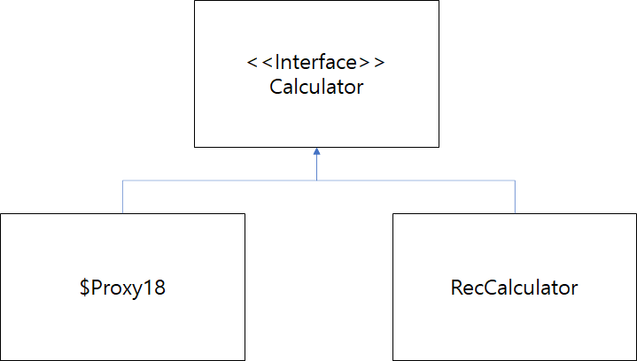

### 7-1. 프록시 / AOP

- 구현한 클래스의 실행시간을 출력하려면 어떻게 해야 할까?

**첫번째 방법**, 메서드의 시작과 끝에 시간을 구하고 이 두 시간의 차이를 출력!

---

- ImplCalculator

```java
public class ImplCalculator implements Calculator {

	@Override
public long factorial(long num) {
		**long start = System.currentTimeMillis();       // 시작시간**
		long result = 1;
		for (long i = 1; i <= num; i++) {
			result *= i;
		}
		**long end = System.currentTimeMillis();         // 종료시간
		// 출력
		System.out.printf("ImplCalculator.factorial(%d) 실행시간 = %d\n", num, (end-start));**
		return result;
	}
}
```

- RecCalculator

```java
public class RecCalculator implements Calculator {

	@Override
	public long factorial(long num) {
		**long start = System.currentTimeMillis();       // 시작시간
		try {**
	    if (num == 0)
	        return 1;
	    else
	        return num * factorial(num - 1);
		} finally {
			**long end = System.currentTimeMillis();         // 종료시간
			System.out.printf("ImplCalculator.factorial(%d) 실행시간 = %d\n", num, (end-start));**
		}
	}
}
```

→ 출력 코드가 중복!!

---

- **두번째 방법, 중복 피하기 (첫 번째 방법의 중복, 수정 피하기)**

```java
public class ExeTimeCalculator implements Calculator {

	private Calculator calculator;

	public ExeTimeCalculator(Calculator calculator) {             **// 의존 주입(calculator)**
    this.calculator= calculator;
	}

	@Override
	public long factorial(long num) {
		**long start = System.nanoTime();                             // 시작시간**
		**long result = calculator.factorial(num);          // factorial 실행**
		**long end = System.nanoTime();                               // 종료시간**
		// 출력
		System.out.printf("%s.factorial(%d) 실행 시간 = %d\n",	calculator.getClass().getSimpleName(),	num, (end - start));
		return result;
	}
}
```

- 실행

```java
public class MainProxy {

	public static void main(String[] args) {
		ExeTimeCalculator case1 = new ExeTimeCalculator(new ImpeCalculator());
		System.out.println(case1.factorial(20));

		ExeTimeCalculator case2 = new ExeTimeCalculator(new RecCalculator());
		System.out.println(case2.factorial(20));
	}
}
/* 출력결과
ImpeCalculator.factorial(20) 실행 시간 = 6100
2432902008176640000
RecCalculator.factorial(20) 실행 시간 = 3900
2432902008176640000
*/
```

- **실행순서**
    1. main코드에서 `ExeTimeCalculator`**(프록시)**의 `factorial` 실행
    2. `ImplCalculator` 의 `factorial` 실행
    3. `ImplCalculator`의 `return`
    4. `ExeTimeCalculator`의 `return`

**→ 다른 객체에 factorial 실행을 위임하여 해결!**

- 프록시(proxy) : 핵심 기능의 실행은 다른 객체에 위임하고 부가적인 기능을 제공하는 객체
    - 핵심기능은 구현하지 않는다
    - 여러 객체에 공통으로 적용할 수 있는 기능을 구현
- AOP : **공통 기능 구현 / 핵심 기능 구현 분리하는 것**이 핵심

### 7-2. AOP(Aspect Oriented Programming)

- 여러 객체에 공통으로 적용할 수 있는 기능을 분리해서 재사용성을 높여주는 프로그래밍 기법
- 스프링도 **프록시(proxy)**를 이용해서 AOP를 구현하고 있다.
1. **공통기능**을 삽입하는 방법 (3가지)
    - **컴파일 시점**에 코드에 공통 기능을 삽입 : 소스 코드를 컴파일 하기 전 공통 구현 코드를 소스에 삽입
    - **클래스 로딩** **시점**에 바이트 코드에 공통 기능을 삽입
    - **런타임**에 **프록시(proxy)** 객체를 생성해서 공통 기능을 삽입 : ★스프링 제공★
        - 따라서, `ExeTimeCalculator` 클래스처럼 상위 타입의 인터페이스를 상속받은 프록시 클래스를 직접 구현할 필요 없다.
2. 용어
- `Advice` : **공통 기능**을 **핵심 로직**에 `언제`적용할 지 정의
    - `@Before` : 메서드 `호출 전`, 공통 기능 실행
    - `@AfterReturning` : 메서드 `익셉션 없이 실행 후`, 공통 기능 실행
    - `@AfterThrowinging` : 메서드 `익셉션 발생 후`, 공통 기능 실행
    - `@After` : 메서드 `실행 후(익셉션 여부X)`, 공통 기능 실행
    - `@Around` : 메서드 `실행 전`, `실행 후`, `익셉션 발생 후`
- `Pointcut` : `Joinpoint` 의 부분집합.
    - `Joinpoint` : `Advice` 의 지점


# 7-3. 스프링 AOP 적용

- `@Aspect` : 클래스
- `@Pointcut` : 공통 기능을 적용할 대상
- 공통 기능 : `@Around` (`Advice` 중 하나)
    - 공통 기능을 적용할 핵심 기능에 `언제` 적용할 지
    - `weaving` : **핵심 로직 코드**에 `Advice`가 적용됨

### 예시코드(공통기능)

```java
**@Aspect                                                           // AOP를 적용할 클래스이다.**
public class ExeTimeAspect {

	**// 공통 기능을 적용할 대상 : chap07 패키지, 그 하위 패키지의 public 메서드**
	**@Pointcut("execution(public * chap07..*(..))")                  // 공통 기능을 적용할 대상**
	private void publicTarget() {
	}

	**@Around("publicTarget()")                                       // 적용할 공통기능
	// ProceedingJoinPoint** **프록시 대상 객체 메서드 호출**
	public Object measure(ProceedingJoinPoint joinPoint) throws Throwable {
		long start = System.nanoTime();
		try {
			Object result = joinPoint.proceed();
			return result;
		} finally {
			long finish = System.nanoTime();
			Signature sig = joinPoint.getSignature();
			System.out.printf("%s.%s(%s) 실행 시간 : %d ns\n", joinPoint.getTarget().getClass().getSimpleName(), sig.getName(), Arrays.toString(joinPoint.getArgs()), (finish - start));
		}
	}
}
```

- `@Aspect` : `Pointcut`, `Advice` 가 제공됨

### 적용

- AppCtx

```java
@Configuration
@EnableAspectJAutoProxy                                  // @Aspect 애노테이션 허용
public class AppCtx {
	@Bean
	public ExeTimeAspect exeTimeAspect() {                 // @Aspect 클래스
		return new ExeTimeAspect();
	}

	@Bean
	public Calculator calculator() {                       **// RecCalculator**
		return new RecCalculator();  
	}
}
```

- main

```java
public class MainAspect {
	
	public static void main(String[] args) {
		AnnotationConfigApplicationContext ctx = 
				new AnnotationConfigApplicationContext(AppCtx.class);

		**// RecCalculator가 아닌 Proxy. @Aspect로 인해 proxy로 감싸져 실행된다.**
		Calculator cal = ctx.getBean("calculator", Calculator.class);
		long fiveFact = cal.factorial(5);
		System.out.println("cal.factorial(5) = " + fiveFact);
		System.out.println(cal.getClass().getName());
		ctx.close();
	}
}
```

- 출력

```java
RecCalculator.factorial([5]) 실행 시간 : 63400 ns
cal.factorial(5) = 120
**com.sun.proxy.$Proxy18                     // RecCalculator가 아닌 Proxy임**
```

1. `main`에서 `cal.factorial` 호출
2. `Proxy(ExeTimeAspect)`에서 `measure` 실행
3. `measure` 의 `proceed` 실행
4. `RecCalculator` 의 `factorial` 실행
- 따라서 `@Aspect` 를 주석하고 다시 실행하면,

```java
@Configuration
@EnableAspectJAutoProxy
public class AppCtx {
//	@Bean
//	public ExeTimeAspect exeTimeAspect() {
//		return new ExeTimeAspect();
//	}

	@Bean
	public Calculator calculator() {
		return new RecCalculator();
	}
}
```

- 출력

```java
cal.factorial(5) = 120
chap07.RecCalculator
```

---

# 7-3-2. ProceedingJoinPoint의 메서드

- 대부분 `proceed()` 메서드만 호출하면 된다.

```java
	public Object measure(ProceedingJoinPoint joinPoint) throws Throwable {
		long start = System.nanoTime();
		try {
			Object result = joinPoint.proceed();               // proceed
			...
		} finally {
			...
		}
	}
}
```

### 호출되는 대상의 정보 구해보자 (proceed 이외에 여러 함수 사용해보자)

- Signature `getSignature()` : 호출되는 **메서드에 대한 정보(시그니처)**
    - String `getName()` : 메서드 이름
    - String `toLongString()` : 메서드를 완전하게 표현한 문장(메서드 리턴 타입, 파라미터 타입)
    - String `toShortString()` : 메서드를 축약해서 표현한 문장
- Object `getTarget()` : **대상 객체**
- Object[] `getArgs()` : **파라미터 목록 구함**

---

# 7-4. 프록시 생성 방식

- 7-3의 코드 수정

```java
public class MainAspect {
	
	public static void main(String[] args) {
		AnnotationConfigApplicationContext ctx = 
				new AnnotationConfigApplicationContext(AppCtx.class);

		**// 기존**
		// Calculator cal = ctx.getBean("calculator", Calculator.class);
		**// 적용 후 RecCalculator**
		Calculator cal = ctx.getBean("calculator", **RecCalculator**.class);
		long fiveFact = cal.factorial(5);
		System.out.println("cal.factorial(5) = " + fiveFact);
		System.out.println(cal.getClass().getName());
		ctx.close();
	}
}
```

```java
@Configuration
@EnableAspectJAutoProxy                                  // @Aspect 애노테이션 허용
public class AppCtx {
	@Bean
	public ExeTimeAspect exeTimeAspect() {                 // @Aspect 클래스
		return new ExeTimeAspect();
	}

	@Bean
	public Calculator calculator() {                      ****
		return new RecCalculator();  
	}
	// AOP적용시 RecCalculator가 상속받은 Calculator 인터페이스를 이용해 Proxy 생성
}
```

- 에러 발생
- 


- 에러를 해결하기 위해서?
    - Bean 객체가 인터페이스를 상속할 때 인터페이스가 아닌 클래스를 이용해 프록시를 생성하고 싶다면 다음과 같이 설정한다.

    ```java
    @EnableAspectJAutoProxy(proxyTargetClass = true)
    ```


# 7.4.1. execution 명시자 표현식

- `Pointcut` 설정에서 execution 명시자를 사용한다.
- 기본형식

```java
/*
 execution(수식어패턴? 리턴타입패턴 클래스이름패턴 ? 메서드이름패턴(파라미터패턴))
- 수식어패턴(생략가능) : public, protected 등. 스프링 AOP는 public만 적용가능
- 리턴타입패턴 : 리턴타입
- 클래스이름패턴, 메서드이름패턴 : 클래스 이름 및 메서드 이름
- 파라미터패턴 : 매칭될 파라미터 명시
* : 모든 값 표현
.. : 0개 이상
*/
**@Pointcut("execution(public * chap07..*(..))")**
	private void publicTarget() {
}
```

# 7.4.2. Advice 적용 순서

- `@Aspect` 가 2개 이상이라면, proxy가 proxy를 감쌀 수 있다. 그렇다면, 순서는?

```java
@Configuration
@EnableAspectJAutoProxy
public class AppCtxWithCache {

	@Bean
	public CacheAspect cacheAspect() {                      // Aspect
		return new CacheAspect();
	}

	@Bean
	public ExeTimeAspect exeTimeAspect() {                  // Aspect
		return new ExeTimeAspect();
	}

	@Bean
	public Calculator calculator() {
		return new RecCalculator();
	}

}
```

- `@Order` 해 먼저 적용할 우선순위를 지정한다. 값이 낮을수록 먼저 수행된다.

```java
@Aspect
@Order(1)
public class ExeTimeAspect {
}

@Aspect
@Order(2)
public class CacheAspect {
}
```

### 실행과정

- `ExeTimeAspect` → `CacheAspect` → `실제객체`