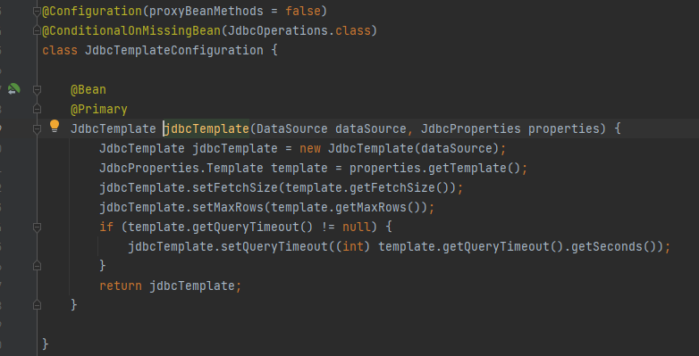
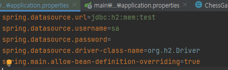

# 8장 DB연동

### 8-1. 스프링의 JDBC 프로그래밍의 단점 보완

- 결론 : **JdbcTemplate 사용**
    - 구조적으로 반복되는 코드의 중복 제거
        - 템플릿 콜백 패턴(전략 패턴의 변형 패턴)
        - JdbcTemplate에 드라이버 로딩, DB연결, 자원해제 기능을 맡긴다(기존 자바 API는, 드라이버로딩 → DB연결 → SQL 작성/전송 → 자원해제)
    - 트랜잭션 관리가 쉽다
        - commit()과 rollback()을 일일이 해주지 않아도 됨 → `@Transactional`

### 8-2. DataSource?

- JDBC 명세의 일부분이며 일반화된 연결 팩토리
- DB와 관계된 Connection정보를 담고 있으며, bean으로 등록하여 인자로 넘긴다.
- 하는일
    - DB 서버와 연결 (Property 설정: url, driver, username, password)
    - 트랜잭션 처리
    - DB Connection Pooling 기능 : 일정량의 Connection을 미리 생성시켜 저장소 저장, 프로그램 요청이 있으면 connection에서 꺼내 시간을 절약
- JdbcTemplate는 DataSource의 의존을 갖는다.


- DataSource를 `@Bean` 으로 등록


- 코드로도 `@Bean` 등록이 가능하다.

```java
@Bean
public DataSource dataSource(){
	DataSource ds = new DataSource();
	...
	ds.setUsername("root");
	ds.setPassword("1234");
	return ds;
}
```

### 커넥션 풀

- 일정 개수의 DB 커넥션을 미리 만들어두는 기법 (성능때문에 사용)
1. 상태를 가진다.
    - `커넥션 풀`에 `커넥션`을 요청하면 `active` 상태가 된다.
    - `커넥션`을 다시 `커넥션 풀`에 반환하면 `idle`(유후) 상태가 된다.
    - `커넥션`을 `close`하면 `커넥션 풀`로 돌아가 idle(유후) 상태가 된다.
2. 커넥션 풀의 커넥션이 유효한지 주기적으로 검사해야 한다.

# 8-3. JdbcTemplate 사용

### 8-3-1. 쿼리 결과가 한행

- `queryForObject()`

### 8-3-2. 변경 쿼리 실행 : `INSERT` , `UPDATE`, `DELETE`

1. `update()`
2. `PreparedStatementCreator`

    ```java
    PreparedStatement statement = connection.prepareStatement(sql);
    statement.setString(1, line.getName());
    statement.setString(2, line.getColor());
    statement.setInt(3, line.getExtraFare());
    return statement;
    ```


### 8-3-3. 자동 생성 키값 구하기 `KeyHolder`

- table의 `ID`를 `AUTO_INCREMENT`로 설정해야 한다.

```java
create table STATION(
    id int auto_increment primary key
}
```

```java
KeyHolder keyHolder = new GeneratedKeyHolder();
  jdbcTemplate.update(connection -> {
    PreparedStatement statement = connection.prepareStatement(sql, new String[]{"id"});
    statement.setString(1, line.getName());
    statement.setString(2, line.getColor());
    statement.setInt(3, line.getExtraFare());
    return statement;
}, keyHolder);
return new Line(keyHolder.getKey().longValue(), line.getName(), line.getColor(), line.getExtraFare());
```

- `keyHolder.getKey()` 를 통해 키값을 가져올 수 있다.

# 8-4. 트랜잭션 처리 `@Transactional`

- 두 개 이상의 쿼리를 한 작업으로 실행해야 할 때 사용하는 것
- 여러 쿼리를 논리적으로 하나의 작업으로 묶음
- `commit` : 한 트랜잭션으로 묶인 모든 쿼리가 성공하여 쿼리 결과를
- `rollback` : 한 트랜잭션으로 묶인 쿼리 중 하나라도 실패하면 전체 쿼리를 실패로 간주하고 실패 이전으로 실행한 쿼리를 취소한다.
- 트랜잭션도 공통 기능 중 하나이다(`AOP`).
    - 따라서, `commit` , `rollback` 을 처리하는 주체는 프록시 객체이다.

### 8-4-1. `@Transactional` 사용하기

- 사용할 곳에 `@Transactional` 를 설정한다
- `@EnableTransactionManagement` 를 통해 활성화 설정

### 8-4-2. `@Transactional`과 프록시

- 트랜잭션도 공통 기능 중 하나이다(`AOP`).

### 8-4-3. `@Transactional` 롤백

- default : `RuntimeException`
    - DB 연동 과정 문제 : `DataAccessException` (`RuntimeException`을 상속받고 있다)
- `SQLException`  도 롤백하고 싶다면?

```java
@Transactional(rollbackFor = SQLException.class)
public void someMethod(){
	...
}
```

- `rollbackFor =`  : 롤백을 지정한다.
- `noRollbackFor =`  : Exception이 발생해도 롤백하지 않고 커밋한다.

## 8-4-4. `@Transactional` 주요 속성

- `value` : 트랜잭션 이름
- `isolation` : 격리레벨
    - 디폴트 : `Isolation.DEFAULT`
- `propagation` : 전파 타입
    - 디폴트 : `Propagation.REQUIRED`
- `timeout` : 트랜잭션 제한 시간
    - 디폴트 : -1 (없음)


### 8-4-4-1.  **`isolation` : 격리 레벨**

- `DEFAULT` : 기본설정
- `READ_UNCOMMITTED` : 다른 트랜잭션이 커밋하지 않은 데이터를 읽을 수 있다.
- `READ_COMMITTED` : 다른 트랜잭션이 커밋한 데이터를 읽을 수 있다.
- `REPEATABLE_READ` : 처음 온 데이터와 두번째 읽어 온 데이터가 동일하다.
- `SERIALIZABLE` : 동일한 데이터에 대해 동시에 두 개 이상의 트랜잭션을 수행할 수 없다.

### 8-4-4-2.  **`propagation` : 전파 타입**

- REQUIRED
    - 메서드를 수행하는 데 트랜잭션이 필요
    - 존재 → 기존 트랜잭션 사용
    - 존재X → 트랜잭션 생성 후 사용
- MANDATORY
    - 메서드를 수행하는 데 트랜잭션이 필요
    - 존재 → 기존 트랜잭션 사용
    - 존재X → `Exception`
- REQUIRES_NEW
    - 항상 새로운 트랜잭션을 시작
    - 존재 → 일시중지 → 새로 생성 후 시작
- SUPPORTS
    - 트랜잭션 필요하지 않지만, 트랜잭션이 존재하면 사용
    - 트랜잭션이 존재하지 않더라도 정상 동작
- NOT_SUPPORTED
    - 트랜잭션 필요 없음
    - 존재 → 일시중지 → 메서드 실행
- NEVER
    - 트랜잭션을 필요로 하지 않음
    - 존재 → `Exception`
- NESTED
    - 존재 → 중첩된 트랜잭션에서 메서드 실행
    - 존재X → REQUIRED와 동작이 같다.