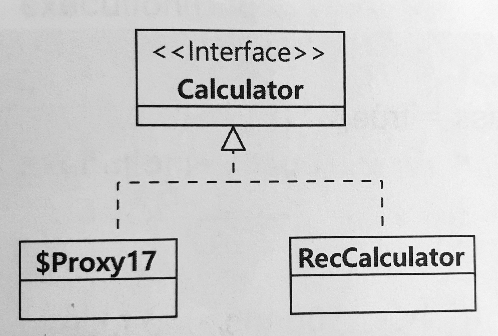

# Chapter 7 AOP 프로그래밍

### 프록시

- 핵심 기능은 구현하지 않고 실행은 다른 객체에 위임한다.
- 대신 여러 객체에 적용할 수 있는 부가적인 기능을 제공하는 객체이다.

```java
public class ExeTimeCalculator implements Calculator {

    private Calculator delegate;

    public ExeTimeCalculator(Calculator delegate) {
        this.delegate = delegate;
    }

    @Override
    public long factorial(long num) {
        long start = System.nanoTime();
        long result = delegate.factorial(num);
        long end = System.nanoTime();

        System.out.printf("%s.factorial(%d) 실행 시간 = %d\n",
                delegate.getClass().getSimpleName(), num, (end - start));
        return result;
    }
}
```

위 처럼 `factorial` 기능을 직접 구현하지 않고 다른 객체에 실행을 위임하며, 계산 기능 외에 실행 시간 측정이라는 부가적인 기능을 실행하는 객체가 프록시이다. `ImpeCaculator` 객체는 프록시의 대상 객체이다.

(엄밀히 말하면 접근 제어 관점에 초점이 맞춰진 프록시 보다, 기능 추가와 확장에 초점이 맞춰진 데코레이터 객체에 가깝다)

## AOP

- Aspect Oriented Programming
- 여러 객체에 공통으로 적용할 수 있는 기능을 분리해서 재사용성을 높여주는 프로그래밍 기법
- 핵심 기능과 공통 기능을 분리하여 핵심 기능을 구현한 코드의 수정 없이 공통 기능을 적용할 수 있게 만들어준다.
- 스프링은 프록시를 이용해 AOP를 구현한다.

### Advice 종류

> 매개 변수로 `JoinPoint` 를 사용한다. 다만 `proceed()` 메서드를 사용하는 `@Around` 의 경우에만 `JoinPoint` 를 상속받은 클래스인 `ProceedingJoinPoint` 를 매개 변수로 사용한다.
>
- `@Before`: 메서드 호출 전
- `@AfterReturning`: 메서드가 Exception 없이 실행된 후
- `@AfterThrowing`: 메서드가 Exception 발생한 경우
- `@After`: 메서드 호출 후
- `@Around`: 메서드 실행 전/후 자유롭게

## 스프링 AOP 구현

1. Aspect로 사용할 클래스에 `@Aspect` 를 붙인다.
2. `@Pointcut` 으로 공통 기능을 적용할 Pointcut을 정의한다.
3. 공통 기능을 구현한 메서드에 `@Around` 를 적용한다.

### 스프링이 제공하는 AOP 방식

- 런타임에 프록시 객체를 생성해서 공통 기능을 삽입한다.
- 스프링 AOP는 프록시 객체를 자동으로 만들어준다. 공통 기능을 구현한 클래스만 알맞게 구현하면 된다.

## 프록시 생성 방식



스프링은 AOP를 위한 프록시 객체를 생성할 때 실제 생성할 빈 객체가 인터페이스를 상속하면 인터페이스를 이용해서 프록시를 생성한다.

```java
// 설정 클래스
// AOP 적용시 RecCalculator가 상속받은 Calculator 인터페이스를 이용해서 프록시 생성
@Bean
public Calculator calculator() {
    return new RecCalculator();
}

// 자바 코드
// "calculator" bean의 실제 타입은 Calculator를 상속한 프록시 타입이므로 RecCalculator로 타입 변환을 할 수 없어 exception 발생
RecCalculator val = ctx.getBean("calculator", RecCalculator.class)
```

### @EnableAspectJAutoProxy

- @Aspect 를 붙인 클래스를 공통 기능으로 적용하기 위해 설정 클래스에 @EnableAspectJAutoProxy 를 붙여야 한다.
- SpringBoot 사용시 spring-boot-starter-aop 의존성이 있으면 `@EnableAspectJAutoProxy`를 자동으로 설정해주기 때문에 위 어노테이션을 사용하지 않아도 된다.
- bean 객체가 인터페이스를 상속할 때 인터페이스가 아닌 클래스를 이용해서 프록시를 생성하고 싶다면 다음과 같이 설정한다.

    ```java
    @Configuration
    @EnableAspectJAutoProxy(proxyTargetClass = true)
    public class AppCtx {
        ...
    }
    ```

### execution 명시자 표현식

`execution(수식어패턴? 리턴타입패턴 클래스이름패턴?메서드이름패턴(파라미터패턴))`

- 수식어패턴: 생략 가능, public, protected 등이 올 수 있다. 스프링 AOP는 public 메서드에만 적용가능하기 때문에 사실상 public만 의미 있다.
- 리턴타입패턴: 리턴 타입 명시
- 클래스이름패턴: 클래스 이름을 패턴으로 명시
- 메서드이름패턴: 메서드 이름을 패턴으로 명시
- 파라미터패턴: 매칭될 파라미터에 대해서 명시

```java
@Pointcut("execution(public * chap07..*(..))")
private void publicTarget() {
}
```

### Advice 적용 순서

- 한 Pointcut에 여러 Advice 적용 가능
- aspect의 적용 순서는 스프링 프레임워크나 자바 버전에 따라 달라질 수 있다.
- `@Order`
    - 적용 순서가 중요하다면 `@Order` 를 사용한다.
    - 애노테이션 값이 작을 수록 먼저 적용한다.

### @Around에 execution 명시자 직접 지정하기

```java
@Aspect
public class CacheAspect {

    @Around("execution(public * chap07..*(..))") 
    public Object execute(ProceedingJoinPoint joinPoint) throws Throwable {
        ...
    }
}
```

- 위처럼 `@Around` 에 execution 명시자를 직접 지정할 수 있다.
- 이전의 코드에서처럼 `@Pointcut` 을 사용하면 Pointcut을 재사용할 수 있다.
- 여러 Aspect에서 공통으로 사용하는 Pointcut이 있다면 별도 클래스에 Pointcut을 정의하고 각 Aspect 클래스에서 해당 Pointcut을 사용하도록 구성하면 편하게 Pointcut을 관리할 수 있다.
