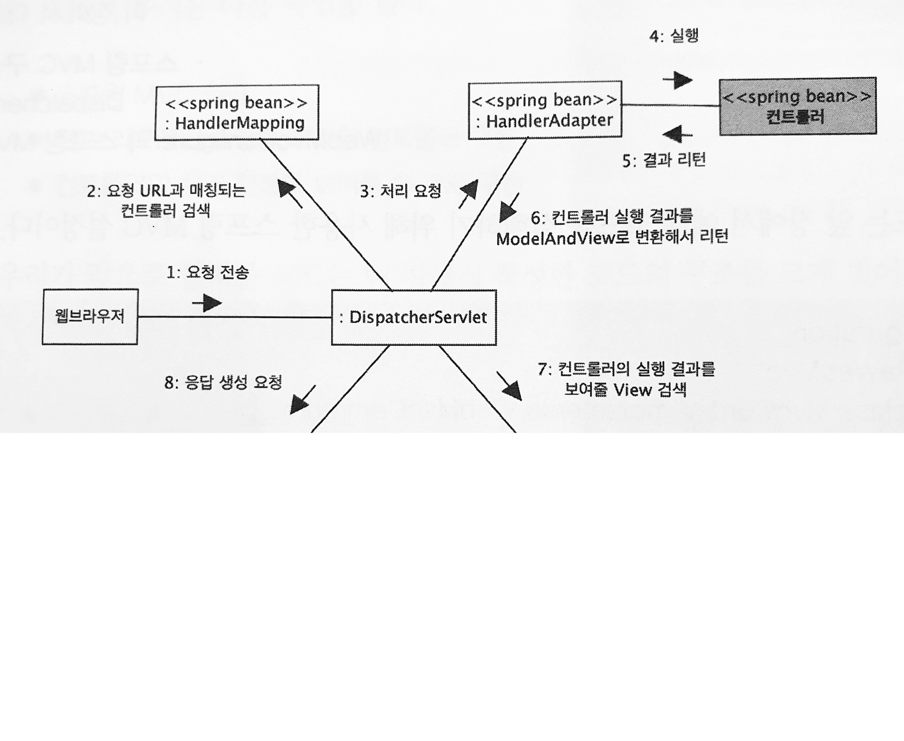

# Chapter 10 스프링 MVC 프레임워크 동작 방식

### 컨트롤러와 핸들러

- `컨트롤러`: 클라이언트의 요청을 실제로 처리한다
- `DispatcherServlet`: 클라이언트의 요청을 전달받는 창구 역할
- `HandlerAdapter`: DispatcherServlet은 실행 결과를 ModelAndView 타입으로만 받으므로, 이 변환을 처리해준다.
- 컨트롤러를 찾아주는 객체가 ControllerMapping이 아닌 HandlerMapping인 이유
    - DispatcherServlet 입장에서는 `@Controller` 를 붙인 클래스 뿐만 아니라 직접 만든 클래스를 이용하여 클라이언트의 요청을 처리할 수도 있다.
    - 이런 이유로 스프링 MVC는 웹 요청을 실제로 처리하는 객체를 핸들러(Handler)라고 표현한다.

### @EnableWebMvc

DispatcherServlet은 웹 브라우저의 요청을 처리할 핸들러 객체를 찾기 위해 HandlerMapping을 사용하고 핸들러를 실행하기 위해 HandlerAdapter를 사용한다. DispatcherServlet은 스프링 컨테이너에서 HandlerMapping과 HandlerAdapter 타입의 빈을 사용하므로 핸들러에 알맞은 두 개의 빈이 스프링 설정에 등록되어 있어야 한다. `@EnableWebMvc` 를 사용하면 자동으로 `@Controller` 타입의 핸들러 객체를 처리하기 위한 설정을 추가해준다.

### ViewResolver

뷰 이름에 해당하는 View 객체를 요청받으면 “prefix+뷰이름+suffix”에 해당하는 경로를 뷰 코드로 사용하는 View 객체를 리턴한다. DispatcherServlet이 View 객체에 응답 생성을 요청하면 객체는 경로에 지정한 JSP 코드를 실행해서 응답 결과를 생성한다.
