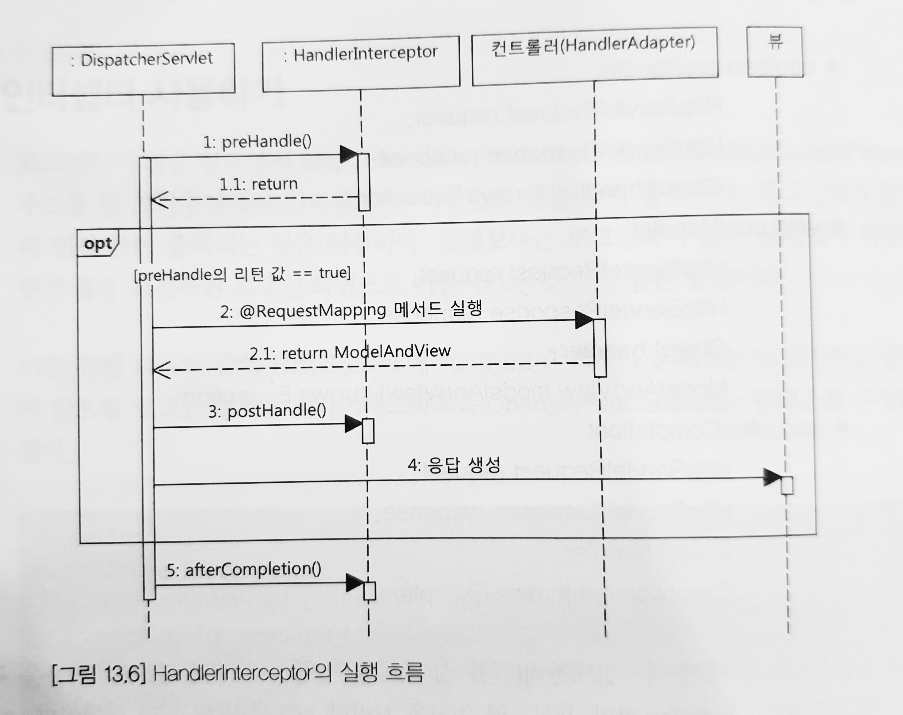

# Chapter 13 MVC 3: 세션, 인터셉터, 쿠키

## HttpSession

- 컨트롤러에서 HttpSession을 사용하는 방법
    1. `@RequestMapping` 적용 메서드에 HttpSession 파라미터를 추가한다.

       → 항상 HttpSession을 생성한다.

    2. `@RequestMapping` 적용 메서드에 HttpServletRequest 파라미터를 추가하고 HttpServletRequest를 이용해서 HttpSession을 구한다.

       → 필요한 시점에만 HttpSession을 생성한다.


### 적용

```java
// 로그인 컨트롤러 메서드에 추가
// 로그인에 성공하면 인증 정보 객체 authInfo를 추가
session.setAttribute("authInfo", authInfo);

// 비밀번호 변경 컨트롤러 메서드에 추가
// 세션에서 인증 정보 객체를 가져옴
session.getAttribute("authInfo");

// 로그아웃 컨트롤러 메서드에 추가
// 세션에서 인증 정보 객체를 제거
session.invalidate();
```

## Interceptor

다수의 컨트롤러에 대해서 동일한 기능을 적용해야 할 때 사용할 수 있다.

### HandlerInterceptor

```java
// 컨트롤러 실행 전
boolean preHandle(HttpServletRequest request,
                  HttpServletResponse response,
                  Object handler) throws Exception;

// 컨트롤러 실행 후, 아직 뷰를 실행하기 전
boolean postHandle(HttpServletRequest request,
                   HttpServletResponse response,
                   Object handler,
                   ModelAndView modelAndView) throws Exception;

// 뷰를 실행한 이후
boolean afterCompletion(HttpServletRequest request,
                        HttpServletResponse response,
                        Object handler,
                        Exceptin e) throws Exception;
```

- preHandle

  메서드가 false를 반환하면 컨트롤러(또는 다음 HandlerInterceptor)를 실행하지 않는다.

- postHandle

  컨트롤러가 예외를 발생하면 postHandle 메서드는 실행되지 않는다.

- afterCompletion

  컨트롤러 실행 과정에서 예외를 발생하면 네 번째 파라미터로 전달된다. 후처리를 하기 적합한 메서드.


### 실행 흐름



### 적용

```java
public class AuthCheckInterceptor implements HandlerInterceptor { 
    @Override 
    public boolean preHandle(HttpServletRequest request, 
                             HttpServletResponse response, 
                             Object handler) throws Exception {
        HttpSession session = request.getSession(false);
        if (session != null) {
            Object authInfo = session.getAttribute("authInfo");
            if (authInfo != null) {
                return true;
            }
        }
        response.sendRedirect(request.getContextPath() + "/login");
        return false;
    }
}
```

```java
// 설정 클래스에 HandlerInterceptor 설정
@Override
public void addInterceptors(InterceptorRegistry registry) {
    registry.addInterceptor(authCheckInterceptor())
            .addPathPatterns("/edit/**");
}
```

- addInterceptor: 인터셉터 설정
- addPathPatterns: 인터셉터를 적용할 경로 패턴을 지정

## Cookie

### @CookieValue

- value: 쿠키 이름 지정
- required: 지정한 이름의 쿠키가 존재하지 않을 수도 있다면 false

```java
// 로그인 컨트롤러

// 쿠키를 파라미터로 전달 받기
@GetMapping
public String form(LoginCommand loginCommand,
        @CookieValue(value="REMEMBER", required=false) Cookie rememberCookie) {
    if (rememberCookie != null) {
        loginCommand.setEmail(rememberCookie.getValue());
        loginCommand.getRememberEmail(true);
    }
    return "login/loginForm";
}

// 쿠기 생성
@PostMapping
public String submit(LoginCommand loginCommand, Errors errors,
        HttpSession session, **HttpServletResponse response**) {
    ...
    Cookie rememberCookie = new Cookie("REMEMBER", loginCommand.getEmail());
    rememberCookie.setPath("/");
    if (loginCommand.isRememberEmail()) {
        rememberCookie.setMaxAge(60 * 60 * 24 * 30);
    } else {
        rememberCookie.setMaxAge(0);
    }
    response.addCookie(rememberCookie);
    ...
}
```
